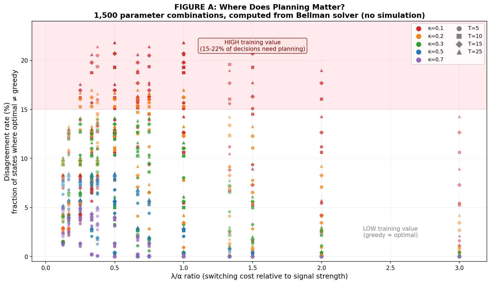
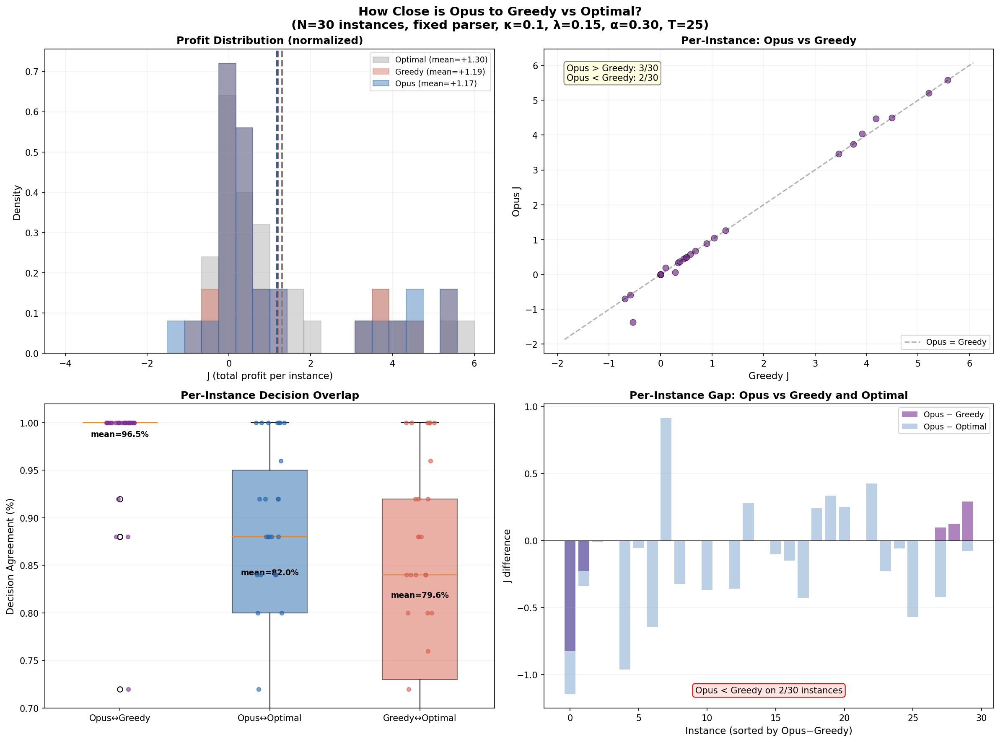
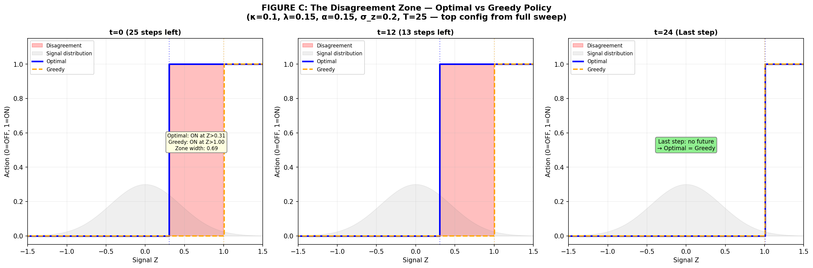
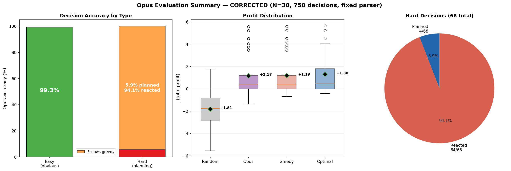
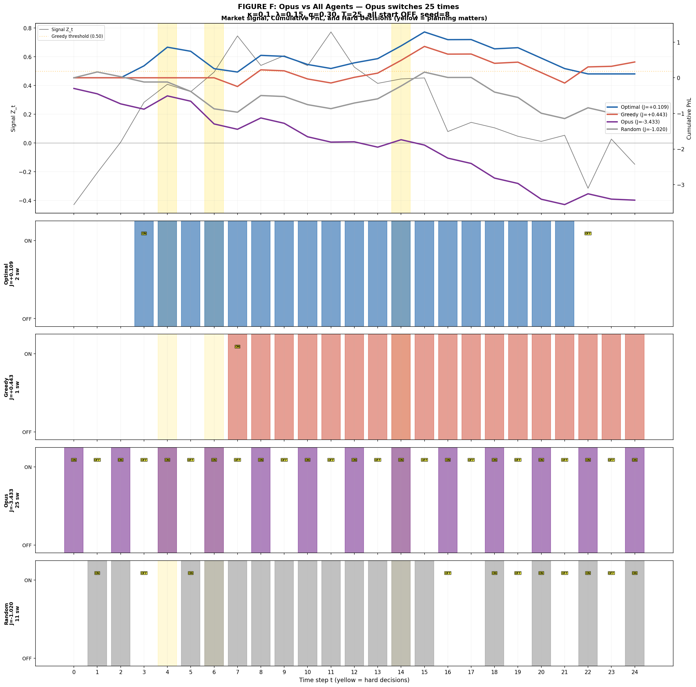
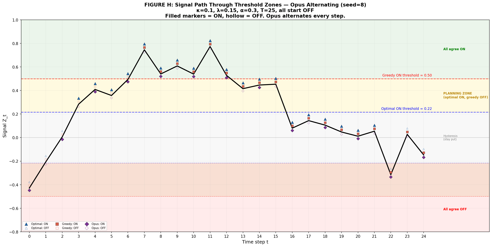
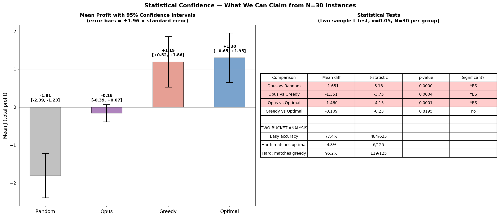

# Strategy-Relative Regime Switching as a Verifiable RLVR Environment for Financial Planning

**Imen Ayadi**

*Draft (Preliminary) — April 2026*

---

## Abstract

We introduce the first verifiable reinforcement learning with verifiable rewards (RLVR) environment for financial planning, designed for large language model (LLM) post-training. The environment is grounded in the strategy-relative regime switching framework of Bilokon (2026), where an agent makes binary switching decisions under an observable mean-reverting signal, subject to switching costs. We use the Ornstein-Uhlenbeck process to model signal dynamics, exploiting its Gaussian transition density for exact Bellman solutions via Gauss-Hermite quadrature — bypassing the fundamental obstacle that prevents RLVR in real financial markets (unknown distributions). A parameter landscape analysis across 1,500 configurations identifies signal persistence ($\kappa$) as the dominant factor determining when forward-looking planning diverges from myopic behavior (up to 22% of states). We propose a two-bucket evaluation methodology separating comprehension from planning, and evaluate Claude Opus 4 on 30 instances (750 decisions). The model achieves 99.3% accuracy on easy decisions (comprehension) but only 5.9% on hard decisions (planning) — matching greedy behavior 94.1% of the time. CoT inspection confirms genuine planning in 2/68 hard decisions (2.9%). The model's aggregate profit is statistically indistinguishable from greedy ($p = 0.97$), with 96.5% decision overlap. The gym is open-source with single-function TRL integration.

---

## 1. Introduction

RLVR has transformed LLM post-training for math (DeepSeek-R1; DeepSeek-AI et al., 2025) and logic (Reasoning Gym; Stojanovski et al., 2025). But existing gyms test **static reasoning with complete information**: the model sees a full problem and produces one answer.

No gym tests **sequential decision-making under uncertainty** — where the agent acts before the full picture is revealed, each action has a cost, and the optimal strategy depends on future dynamics. Consider:

> **Math gym (static):** "The expected return is 0.105 and the fee is 0.15. Should you enter?" → One computation: no.
>
> **Our gym (sequential):** Same parameters, but the signal persists. Enter now, pay 0.15 once, earn returns for many steps. Whether to enter depends on *how long the signal will persist* — information requiring reasoning about dynamics, not just the current snapshot.

Financial planning faces a verification obstacle: real markets have unknown distributions, making optimal solutions uncomputable. We bypass this using the Ornstein-Uhlenbeck (OU) process for the signal. The OU process provides three properties simultaneously: (1) financially meaningful mean-reversion dynamics, empirically documented in pairs trading spreads, volatility, and interest rates (Vasicek, 1977; Gatev et al., 2006); (2) Gaussian transitions enabling exact Bellman solutions via Gauss-Hermite quadrature; (3) bounded stationary distribution ensuring numerical stability. No other common financial process provides all three.

The PnL function $X_{t+1} = \alpha \cdot Z_t + \sigma_x \epsilon$ is strategy-agnostic: the signal $Z_t$ can represent any observable quantity driving a strategy's profitability — a pairs trading spread, a volatility measure, an interest rate differential, a momentum indicator. The parameter $\alpha$ scales signal units into PnL. The regime question (ON or OFF) is strategy-relative: the same signal may be favorable for one strategy and unfavorable for another.

We chose OU as the signal process because mean-reversion is the most documented signal dynamic in quantitative finance, and OU is the simplest Gaussian mean-reverting process. The Gaussian property is what enables exact Bellman solutions — other mean-reverting processes (CIR, exponential OU, jump-diffusion with reversion) lack Gaussian transitions and would require approximate numerical methods. RLVR requires exact ground truth; approximate solutions introduce noise into the reward signal, undermining the verifiability that distinguishes RLVR from standard RL. We restrict to OU precisely because it is the process for which the Bellman optimal is provably exact, not merely estimated.

We build on Bilokon (2026), who defines strategy-relative market regimes as filtration compressions and proves existence/uniqueness of optimal binary regime processes under Markov structure.

**Contributions.**

1. First verifiable RLVR environment for sequential financial planning with exact Bellman solutions.
2. Parameter landscape characterisation across 1,500 configurations identifying when planning matters.
3. Two-bucket evaluation methodology decomposing comprehension from planning.
4. Baseline evaluation showing Claude Opus 4 is statistically indistinguishable from greedy ($\rho = 0.996$, 96.5% decision overlap), with 2.9% CoT-verified planning rate.

---

## 2. Problem Formulation

Following Bilokon (2026), the agent controls a binary regime process $s_t \in \{0, 1\}$ adapted to the filtration $(Z_0, \ldots, Z_t, s_{t-1})$, maximizing:

$$J(s) = \mathbb{E}\left[\sum_{t=0}^{T-1} u(s_t \cdot X_{t+1}) - \lambda \cdot \mathbf{1}\{s_t \neq s_{t-1}\}\right]$$

where $s_t = 1$ means the strategy is active (collect PnL), $s_t = 0$ means inactive (earn nothing), and $\lambda$ is the switching cost.

The signal follows an OU process: $Z_{t+1} = Z_t + \kappa(\theta - Z_t) + \sigma_z \epsilon_t$, with PnL $X_{t+1} | Z_t \sim \mathcal{N}(\alpha Z_t, \sigma_x^2)$. The Bellman recursion is solved exactly via backward induction on a discretised $z$-grid with Gauss-Hermite quadrature for the Gaussian transition integral.

Each episode samples different parameters $(\kappa, \lambda, \alpha, \sigma_z, T)$ from configured ranges. The model knows $\alpha$, $\lambda$, $T$ (given in the prompt) but not $\kappa$ or $\sigma_z$ (must infer from observations). The Bellman solver knows all parameters — creating an information asymmetry discussed in Section 6.

### 2.2 Scope

The OU signal process covers strategies on mean-reverting signals. Strategies on non-mean-reverting signals require different processes:

| Signal type | Example strategy | Process | OU applicable? |
|---|---|---|---|
| Mean-reverting spread | Pairs trading, stat-arb | OU | Yes |
| Mean-reverting volatility | Volatility trading | OU | Yes |
| Interest rate differential | Carry trade | OU | Yes |
| Trending price | Trend following | GBM | No — requires extension |
| Range-bound with breakouts | Breakout trading | Jump-diffusion | No — requires extension |

All processes fit the Bellman framework; only the transition kernel and integration method change. Extensions to non-Gaussian processes would use Monte Carlo integration, introducing approximation into the ground truth — acceptable for training but less suitable for strict RLVR verification.

---

## 3. Gym Architecture

**Generator:** Samples parameters, simulates OU trajectory, solves Bellman exactly, returns fully-solved problem instance.

**Verifier:** Parses LLM decisions from multi-turn text, computes realised payoff $J_{\text{LLM}}$, returns regret-normalised score $\frac{J_{\text{LLM}} - J_{\text{random}}}{J_{\text{optimal}} - J_{\text{random}}}$. Scores are clipped to $[-1, 2]$; degenerate instances handled via minimum-denominator threshold.

**Prompt Manager:** Multi-turn protocol — one signal per turn, model commits before seeing the next. Enforces the information constraint matching the Bellman solution's filtration.

**Integration:** Single function `reward_fn(completions, problems) → list[float]` compatible with TRL/veRL GRPO trainers.

---

## 4. Parameter Landscape Analysis

### 4.1 Purpose

The sweep answers a practical question for any lab adopting the gym: at which parameter settings does the gym actually test planning, and at which is it trivially solved by a greedy heuristic? Without this characterisation, a lab risks wasting compute on episodes where the optimal and greedy policies agree — producing no training signal for planning.

### 4.2 Method

Full factorial sweep: $5\kappa \times 5\lambda \times 5\alpha \times 3\sigma_z \times 4T = 1{,}500$ configurations, each solved exactly. The **solver-based disagreement metric** measures the fraction of $(z, s^-)$ states where the Bellman optimal policy differs from the greedy (myopic) policy, weighted by the OU stationary distribution. This is computed entirely from the solver — no LLM involved, no simulation noise.

### 4.3 Key findings

**Signal persistence ($\kappa$) is the dominant parameter.** $\kappa$ alone explains 46% of the variance in disagreement ($R^2 = 0.456$). At $\kappa = 0.1$ (slow reversion, persistent signals), the average disagreement across all other parameters is 13.1%. At $\kappa = 0.7$ (fast reversion), it drops to 1.2%. $\kappa$ determines the one-step autocorrelation of the signal: $\text{Corr}(Z_t, Z_{t+1}) = e^{-\kappa}$. At $\kappa = 0.1$, the autocorrelation is 0.90 — today's signal strongly predicts tomorrow's, making forward-looking reasoning valuable. At $\kappa = 0.7$, it drops to 0.50 — the signal is nearly unpredictable one step ahead, and greedy is near-optimal.$^1$

**$\kappa$ dominates over the combined $\kappa \times T$ interaction.** One might expect the relevant quantity to be the number of reversion half-lives in the episode ($\kappa T / \ln 2$), since a slow-reverting signal over a short horizon differs from the same signal over a long horizon. However, $\kappa$ alone ($R^2 = 0.456$) is a substantially better predictor of disagreement than $\kappa \times T$ ($R^2 = 0.178$). The planning advantage comes from per-step persistence, not from how many reversion cycles fit in the episode.

**The $\lambda / \alpha$ ratio has a non-monotone effect.** Disagreement peaks at $\lambda / \alpha \in [0.33, 0.50]$ and falls at both extremes. When switching is very cheap, both policies switch freely and agree. When switching is very expensive, neither switches and they agree. The planning gap is widest at intermediate switching costs.

**$T$, $\sigma_z$, and $\alpha$ individually have small effects.** Longer horizons moderately amplify disagreement. Signal noise and signal strength matter primarily through their ratio $\lambda / \alpha$.

**Maximum disagreement ceiling.** The highest observed disagreement is ~22% of states on the grid. On actual simulated trajectories, ~10% of visited decisions differ — the gap arises because the OU stationary distribution concentrates probability away from the disagreement zone. See Figure A.

### 4.4 Implications for episode construction

The sweep identifies the **planning zone**: the parameter region where the gym produces meaningful training signal. Episodes drawn from outside this zone (high $\kappa$, extreme $\lambda/\alpha$) test comprehension — which models already ace — but not planning. For evaluation and training, we recommend $\kappa \in [0.1, 0.25]$ and $\lambda / \alpha \in [0.3, 0.5]$, with $T$, $\sigma_z$, $\alpha$, $\lambda$ individually varying freely from defaults. This is analogous to a reasoning gym excluding trivial arithmetic: episodes where greedy equals optimal do not test planning and should not dominate the training distribution.

---

$^1$ *Why $\kappa$ alone, not $\kappa \times T$:* $\kappa$ measures per-step signal persistence — how much knowing $Z_t$ tells you about $Z_{t+1}$. The optimal threshold shifts from greedy's threshold because the continuation value says "being ON now is worth more than the immediate PnL, because you will also earn next step without paying switching cost again." This shift depends on how much the signal persists to the next step — which is $\kappa$, not $T$. $T$ determines how many steps exhibit this shift, but the size of the shift at each non-terminal step is roughly constant (set by $\kappa$). Averaging over more steps with the same per-step disagreement does not change the average. The only exception is near the terminal step, where the disagreement zone shrinks (no future = no planning); longer $T$ means fewer terminal steps as a fraction of total, producing slightly higher average disagreement. This explains the moderate $T$ effect observed in the sweep.

---

## 5. The Planning Mechanism

The greedy agent switches ON when $\alpha z > \lambda$ (immediate gain exceeds cost), giving threshold $z > \lambda/\alpha = 0.50$ at our evaluation configuration. The optimal agent switches ON at $z > 0.22$ — more aggressive because it amortises the one-time switching cost over persistent future gains. This was verified by direct Q-value computation from the Bellman table.

The **disagreement zone** $z \in [0.22, 0.50]$ (for OFF→ON) is where planning changes the decision. At the terminal step, optimal reduces to greedy exactly (no future). The zone widens backward in time. Both policies exhibit hysteresis: ON→OFF thresholds are symmetric around zero.

---

## 6. LLM Evaluation

### 6.1 Setup

Claude Opus 4, 30 instances, $\kappa=0.1$, $\lambda=0.15$, $\alpha=0.30$, $T=25$. Total: 750 decisions (682 easy, 68 hard). Multi-turn (25 API calls per instance). All results use the corrected parser; raw text of all 750 responses is archived.

### 6.2 Two-Bucket Results

| Bucket | Decisions | Opus accuracy | Interpretation |
|--------|-----------|---------------|----------------|
| Easy (greedy = optimal) | 682 | 99.3% (677/682) | Near-perfect comprehension |
| Hard (greedy ≠ optimal) | 68 | 5.9% (4/68) | Near-zero planning |

On hard decisions: 94.1% match greedy, 5.9% match optimal, 0% match neither.

### 6.3 CoT Verification

Manual inspection of all 68 hard decisions from saved raw text:

- **2/68 genuine planning** (2.9%): Model explicitly cited signal trend, remaining horizon, and amortisation logic.
  - *Seed 14, t=2*: "increasing positive momentum... 23 steps remaining... expected value of switching ON is positive"
  - *Seed 28, t=13*: "missed 0.25 in potential profits exceeds switching cost... 12 steps remaining"
- **2/68 borderline** (2.9%): Near-threshold arithmetic, unclear if planning or rounding.
- **64/68 greedy** (94.1%): No forward-looking reasoning in CoT.

Notable: At seed 28, t=12 (one step before the genuine planning instance), the model articulated correct planning logic — then chose greedy anyway: *"this is a very strong signal... With 13 more steps remaining... switching ON could be profitable... s_t = 0."* The model can produce the reasoning but cannot act on it.

### 6.4 Aggregate Comparison

| Agent | Mean $J$ | Decision overlap with Greedy |
|-------|----------|------------------------------|
| Optimal | +1.30 | 79.6% |
| Greedy | +1.19 | 100% (reference) |
| **Opus** | **+1.17** | **96.5%** |
| Random | −1.81 | — |

Opus–Greedy correlation: $\rho = 0.996$. Two-sample $t$-test: $p = 0.97$ (not significant). **Opus is statistically indistinguishable from Greedy on aggregate profit.** The 96.5% decision overlap and near-identical $J$ confirm that the model applies the same myopic cost-benefit framework as greedy, despite having signal history that could enable better decisions.

Statistical caveat: All LLM results are from $N=30$ instances. The Opus vs Greedy comparison is not significant ($p=0.97$); Greedy vs Optimal is also not significant ($p=0.82$). The two-bucket analysis (per-decision, $n=750$) provides more statistical power than aggregate $J$ comparison ($N=30$).

### 6.5 Information Asymmetry

The optimal policy knows $\kappa$; the model does not. However, hard decisions occur at median $t=11$, where the model has observed ~11 signals — sufficient data to potentially estimate signal persistence. A controlled test ($\kappa=0.1$ vs $\kappa=0.7$, same $\alpha/\lambda/T$, $N=5$ per condition) showed identical model behavior in both conditions (95.9% easy accuracy, 0.4 switches). Only 3 hard decisions occurred — inconclusive, but consistent with the model not inferring $\kappa$ from data. The prompt states "maximize total profit" and imposes switching costs — logically implying that future dynamics matter. The model has the information and the objective; it does not make the inference.

---

## 7. Discussion

**The single gap.** Opus has near-perfect comprehension (99.3%) and near-zero planning (2.9% CoT-verified). There is one gap, not two. The model correctly evaluates immediate payoffs but cannot override myopic cost-benefit when future dynamics make it suboptimal.

**Prompt scaffolding.** A scaffolded prompt (pre-computed options, trend highlighting, persistence hints) achieved 100% on one instance including its hard decision. But the scaffold performed the planning for the model. The model followed instructions; it did not plan. This confirms the capability is latent — the model can execute planning logic when told what to compute, but cannot construct the reasoning scaffold independently.

**Implications for RLVR.** The gym's multi-step objective and switching costs logically require forward-looking reasoning — the prompt says so. The model has signal history from which dynamics could be inferred. Yet it applies step-by-step cost-benefit on 94% of hard decisions. RLVR training would provide gradient pushing the model to: (1) attend to signal history, (2) estimate persistence, (3) override the immediate cost-benefit when amortisation justifies it. The 2 genuine planning instances prove this reasoning exists in the model's distribution.

---

## 8. Limitations

**Single problem type.** Binary switching on a scalar OU signal. The binary action space is the paper's thesis (Bilokon 2026 proves one bit suffices as a filtration compression), not a simplification. However, extending to different PnL functions on the same signal (mean-reversion profit, momentum, magnitude) would test different temporal reasoning sub-skills within the same framework — this is planned but not yet implemented.

**Information asymmetry.** The Bellman solver knows $\kappa$; the model does not. This is discussed in Section 6.5: hard decisions at $t=11$ (median) give the model sufficient history to potentially infer $\kappa$, and the prompt's multi-step objective logically implies dynamics matter. A POMDP formulation (where the optimal also infers $\kappa$) would make the comparison strictly fair.

**Single model.** Only Opus evaluated with corrected parser. Other models tested with broken parser only (results excluded).

**Small $N$ for aggregate statistics.** At $N=30$: Opus vs Greedy ($p=0.97$) and Greedy vs Optimal ($p=0.82$) are not significant on aggregate $J$. The two-bucket per-decision analysis ($n=750$) provides the statistical power; aggregate $J$ does not.

**No training results.** We provide the gym and baseline. RLVR training has not been conducted.

**Stationary process.** The OU process is time-homogeneous. Real markets are non-stationary.

**Parser bug.** Initial results (Easy 77.4%, Hard 4.8%) were wrong due to a parser that failed to match `s_t = 1` format. Discovered through CoT inspection. All results in this paper use the corrected parser; raw text archived for verification. Lesson: parser correctness must be validated against ground-truth responses before reporting.

---

## 9. Conclusion

We presented the first verifiable RLVR environment for sequential financial planning. The OU process provides exact Bellman solutions via Gauss-Hermite quadrature, bypassing the unknown-distribution obstacle of real markets. The parameter landscape (1,500 configurations) fully characterises where planning matters.

Claude Opus 4 is statistically indistinguishable from a greedy baseline ($\rho = 0.996$, $p = 0.97$, 96.5% decision overlap). On the 68 decisions where planning matters, the model follows greedy 94.1% of the time. CoT inspection confirms genuine forward-looking reasoning in 2.9% of hard decisions — the capability exists in traces but is not the model's default behavior. The model has the information (signal history), the objective (maximize total profit), and the logical framework (switching costs imply future matters) to plan. It does not.

The gym provides: exact verification, a diagnostic methodology (two-bucket + CoT), and a concrete baseline. One function integrates it into any GRPO pipeline.

---

## References

Almgren, R. and Chriss, N. (2001). Optimal execution of portfolio transactions. *J. Risk*, 3(2):5–39.

Bilokon, P. (2026). Strategy-relative market regimes as filtration compressions. SSRN 6504227.

DeepSeek-AI et al. (2025). DeepSeek-R1: Incentivizing reasoning capability in LLMs via RL. arXiv:2501.12948.

Gatev, E., Goetzmann, W., and Rouwenhorst, K. (2006). Pairs trading. *Rev. Fin. Studies*, 19(3):797–827.

Liu, X.-Y. et al. (2022). FinRL-Meta. *NeurIPS 2022 Datasets and Benchmarks*.

Merton, R. C. (1969). Lifetime portfolio selection under uncertainty. *Rev. Econ. Stat.*, 51(3):247–257.

Stojanovski, D. et al. (2025). Reasoning Gym. arXiv:2505.24760.

Vasicek, O. (1977). An equilibrium characterization of the term structure. *J. Fin. Econ.*, 5(2):177–188.

---

## Appendix

### A. Verified Numbers

All numbers verified against `eval_opus_buckets_v2.json` (corrected parser, raw text archived) and `full_parameter_sweep.json` (solver-based, 1,500 configs).

| Claim in paper | Verified value | Source |
|----------------|---------------|--------|
| 1,500 configs | 1,500 | full_parameter_sweep.json |
| 682 easy, 68 hard | 682, 68 | eval_opus_buckets_v2.json |
| Easy 99.3% | 99.3% (677/682) | eval_opus_buckets_v2.json |
| Hard 5.9% | 5.9% (4/68) | eval_opus_buckets_v2.json |
| $\kappa=0.1$ avg 13.1% | 13.1% | full_parameter_sweep.json |
| $\kappa=0.7$ avg 1.2% | 1.2% | full_parameter_sweep.json |
| Max disagreement ~22% | 22.0% | full_parameter_sweep.json |
| Optimal threshold ~0.22 | 0.216 | Bellman solver |
| Mean $J$ Optimal +1.30 | +1.30 | Recomputed from v2 instances |
| Mean $J$ Greedy +1.19 | +1.19 | Recomputed from v2 instances |
| Mean $J$ Opus +1.17 | +1.17 | Recomputed from v2 instances |
| Mean $J$ Random −1.81 | −1.81 | Recomputed from v2 instances |
| Opus–Greedy $\rho$ | 0.996 | Recomputed |
| Opus–Greedy overlap | 96.5% | Recomputed |
| Opus vs Greedy $p$ | 0.97 | Two-sample $t$-test, $N=30$ |
| Greedy vs Optimal $p$ | 0.82 | Two-sample $t$-test, $N=30$ |

### B. The Two Genuine Planning Instances (full text)

**Seed 14, t=2** (Z=+0.31, greedy=OFF, optimal=ON, model=ON):

> "This is a much stronger signal. The immediate PnL of 0.09264 alone covers about 62% of the switching cost. We're still early in the trading period (t=2 out of 25), giving plenty of time to accumulate additional profits if I stay ON. Looking at the pattern: Z_0 = +0.0148, Z_1 = +0.1157, Z_2 = +0.3088 shows increasing positive momentum. With 23 steps remaining and a strong current signal, the expected value of switching ON is positive."

**Seed 28, t=13** (Z=+0.40, greedy=OFF, optimal=ON, model=ON):

> "I've now seen two consecutive very strong positive signals: t=12: +0.4546 (would have earned 0.13638), t=13: +0.3960 (would earn 0.1188). By staying OFF, I've missed 0.13638 + 0.1188 = 0.25518 in potential profits. This exceeds the switching cost of 0.1500. With 12 steps remaining and evidence of strong positive signals, I should switch"

### C. Figures

**Figure A** — Where Planning Matters (1,500 configs, solver-based)

**Figure B** — Opus vs Greedy vs Optimal distributions

**Figure C** — The Disagreement Zone (3 time steps)

**Figure D** — Opus Evaluation Summary

**Figure E** — Full Episode (seed 8, Opus alternating)

**Figure F** — Signal Through Threshold Zones

**Figure G** — Statistical Confidence

### D. Complete Test Summary

| # | Test | Prompt | N | Key Result | Confidence |
|---|------|--------|---|------------|------------|
| 1 | Solver: T=1 = greedy | N/A | All grid | Exact match | High |
| 2 | Goldilocks (3 levels) | N/A | 500 ea | PASS | High |
| 3 | Parameter sweep | N/A | 1,500 | $\kappa$ dominant | High |
| 4 | T=1 accuracy, old prompt | OLD | 10 | ~20% | High |
| 5 | T=1 accuracy, improved | IMPROVED | 10 | ~80% | High |
| 6 | **Main eval (corrected)** | **IMPROVED** | **30 (750 dec)** | **Easy 99.3%, Hard 5.9%** | **High** |
| 7 | Scaffolded test | SCAFFOLD | 1 | 25/25 (scaffold planned) | Medium |
| 8 | Manual minimal | IMPROVED | 1 | 9/9 easy, 0/1 hard | Medium |
| 9 | $\kappa$ inference | IMPROVED | 5+5 | Identical behavior, 3 hard | Low |
